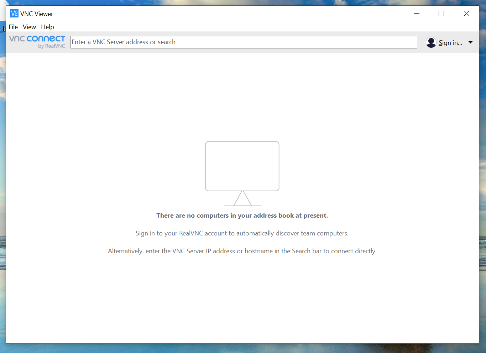
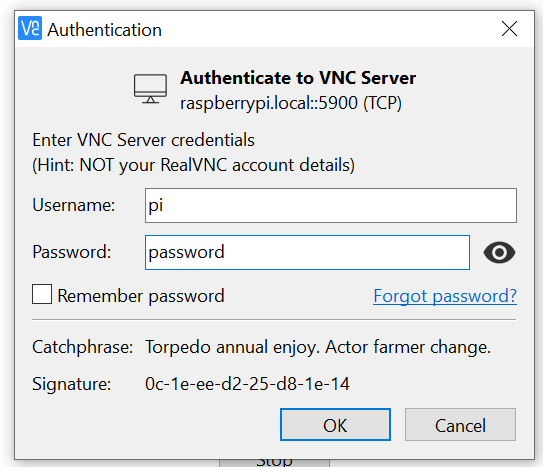
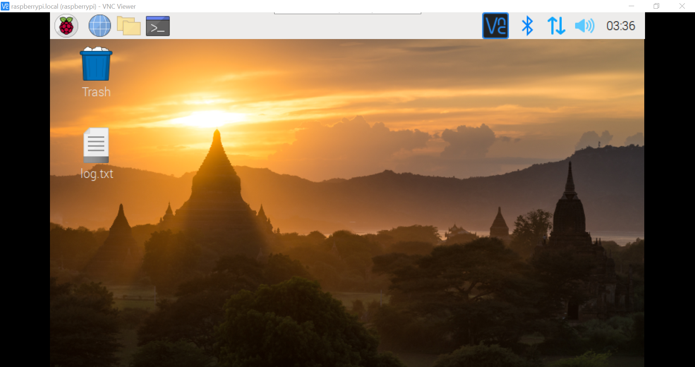

# Hvordan koble til raspberry pi.

Hvis du vil koble til Raspberry Pi finnes det mange måter å gjøre det på. Denne guiden vil vise to måter å koble seg til, slik at man fjernstyrer det grafiske brukergrensesnittet fra egen pc.

### Step 1 - Installasjon
For å koble til PIen trenger man programmet *VNC Viewer*. Det kan lastes ned [her](https://www.realvnc.com/en/connect/download/viewer/).

Nå finnes det to måter å koble til på. Enten ved hjelp av nettverkskabel eller trådløst via wifi. Disse to måtene blir forklart videre.

### Step 2a - Tilkobling via kabel.

For å koble til fysisk, må du ha en ethernet-kabel og en pc med ethernet kontakt. Koble så Raspberry Pi sammen med PCen, med kabelen.

Så åpner du *VNC Viewer* og skriver `raspberrypi.local` i feltet øverst.

Så blir du bedt om å logge inn, og da er brukernavnet *pi* og passordet er *password*, som vist på bildet under.

Når du trykker *Ok*, så skal du bli koblet inn på Raspberry PIen, og blitt møtt av skrivebordet til PIen, som vist på bildet under.

### Step 2b - Trådløs tilkobling.
Hvis du skal koble til trådløst, må du først sørge for at Raspberry PIen og PCen din er tilkoblet samme Wifi. Når de er tilkoblet, så skriver du inn følgende ip-adresse i feltet øverst i *VNCViewer*.

`169.254.154.200`

Deretter bruker du samme innloggingsinfo som for kablet tilkobling.

Du skal nå ha en trådløs tilkobling så lenge enhetene er tilkoblet samme wifi.