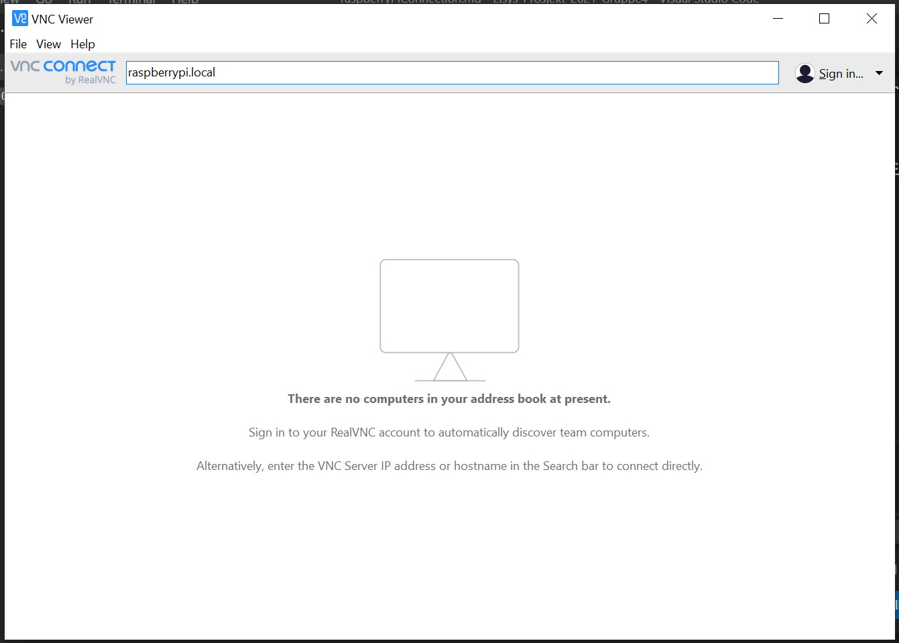

# Hvordan koble til raspberry pi.

Hvis du vil koble til Raspberry Pi finnes det mange måter å gjøre det på. Denne guiden vil vise to måter å koble seg til, slik at man fjernstyrer det grafiske brukergrensesnittet fra egen pc.

### Step 1 - Installasjon
For å koble til PIen trenger man programmet *VNC Viewer*. Det kan lastes ned [her](https://www.realvnc.com/en/connect/download/viewer/).

Nå finnes det to måter å koble til på. Enten ved hjelp av nettverkskabel eller trådløst via wifi. Disse to måtene blir forklart videre.

### Step 2a - Tilkobling via kabel.

For å koble til fysisk, må du ha en ethernet-kabel og en pc med ethernet kontakt. Koble så Raspberry Pi sammen med PCen, med kabelen.

Så åpner du *VNC Viewer* og skriver `raspberry.local` i feltet øverst.

